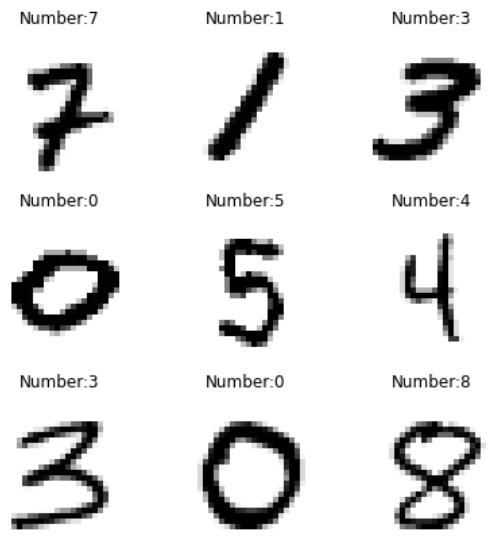
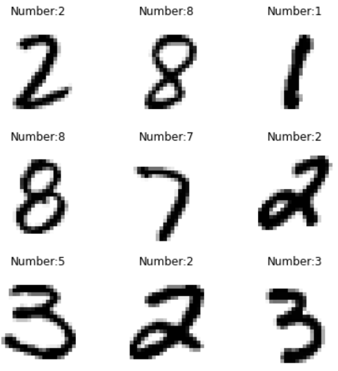
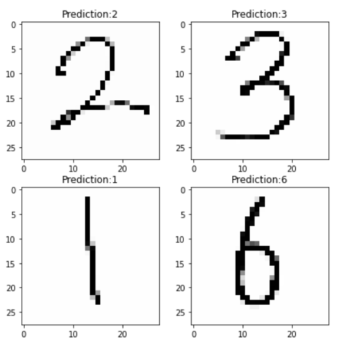
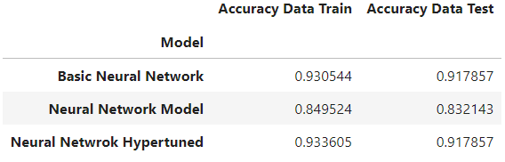
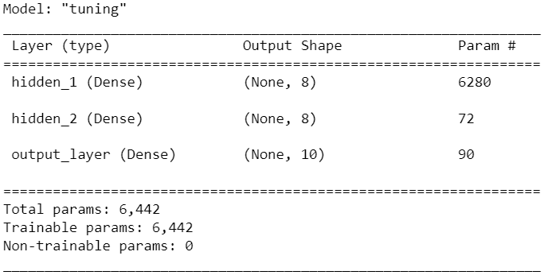
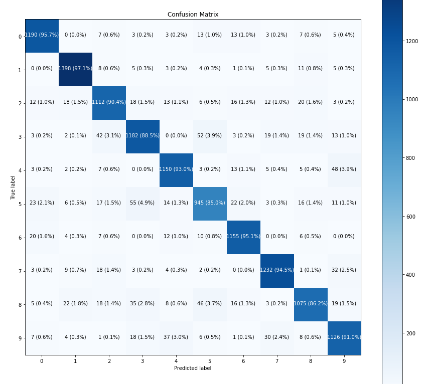

# Digit-Recognizer-Using-Artificial Neural Network

On this project, i want to share how computer can process image input (Computer Vision), in this case model will predict number using Artificial Neural Network (Deep Learning).

 
For full report of this project, please visit <a href=https://github.com/Juantonios1/Digit-Recognizer-Using-ANN/blob/main/Digit%20Recognizer%20Ipynb/Digit%20Recognizer%20Using%20Artificial%20Neural%20Network.ipynb>
Digit Recognizer Using Artificial Neural Network</a>.

## Summary Process
<!-- TABLE OF CONTENTS -->

  
Table of Content

  <ol>
    <li><a href="#problem-statement">Problem Statement</a></li>
    <li><a href="#data-understanding">Data Understanding</a></li>
    <li><a href="#data-preprocessing">Data Preprocessing</a></li>
    <li><a href="#data-analytics">Data Analytics</a></li>
    <li><a href="#modeling">Modeling</a></li>
    <li><a href="#prediction">Prediction</a></li>
    <li><a href="#conclusion">Conclusion and Recommendation</a></li>
    <li><a href="#contributors">Contributors</a></li>
  </ol>

## Problem Statement
**Background :**  
One of the very popular application in computer vision is Handwritten Digits Classification or Recognition (HDR) in the field of character recognition. Digits like other universal symbols are widely used in technology, bank, OCR, analyzing of digits in engineering, postal service, numbers in plate recognition, etc. There are 10 classes corresponding to the handwritten digits from ‘0’ to ‘9’ which are very depend on the handwritten.
  Source: https://www.ijeter.everscience.org/Manuscripts/Volume-4/Issue-6/Vol-4-issue-6-M-48.pdf

**Problem :**  
Computer can't process directly image input, to process the image input and achieve the goals, we need convert image input to 'something the computer understands'.

**Goals :**  
Model can convert handwritten digits into machine readable formats.

**Metrix Evaluation**
Multiclass Accuracy: Error in each class is important.

## Data Understanding

All dataset based on <a href=https://www.kaggle.com/competitions/digit-recognizer/data> MNIST Number Dataset</a>. Sample Data:

* Data Train: Contain 42000 images. Each image has 1 label and pixels with height 28 pixels and width 28 pixels.
* Data Test: Contain 28000 images. Each row pixels with height 28 pixels and width 28 pixels.

## Data Preprocessing
At this stage, data preparation and processing will be carried out before being used as a data model, as follows:
* Normalization.
* Shuffle Dataset.
* Splitting.

## Modeling
At this stage will be done making and optimizing the deep learning model, as follows:
* Baseline.
* Adjust parameter on model.
  * Batch.
  * Epoch.
  * Hidden Layer.
  * Regularization.
  * Optimizer.
  * Learning Rate.
* Hyperparameter Tuning.

## Prediction
At this stage there will be try model to predict several sample:
* Sample Data from Datatest:

* Handwriting Sample

## Conclusion 
We conclude our result and give recommendation based on it

* Model Performance

   

* Summary Model  

   

* Evaluation Metrix

   

* Conclusion
  * This model can differentiate single number based on input picture, but there are some limitation such as:
      * Model hard to differentiate the different style of number.
      * The position number on pictre is important.
      * Model only prefectly predict particular number (1,2,3,6).
      * Model can only predict number with white color and black background color.
  * Overall Artificial Neural Network can be used to Computer Vision, but its **not recommended**.

* Recommendation
  * Use **Convolutional Neural Network (CNN)** for Computer Vision.
 

For full report of this project, please visit <a href=https://github.com/Juantonios1/Digit-Recognizer-Using-ANN/blob/main/Digit%20Recognizer%20Ipynb/Digit%20Recognizer%20Using%20Artificial%20Neural%20Network.ipynb>
Digit Recognizer Using Artificial Neural Network</a>.

## Contributors:
Juan Antonio Suwardi - antonio.juan.suwardi@gmail.com  
